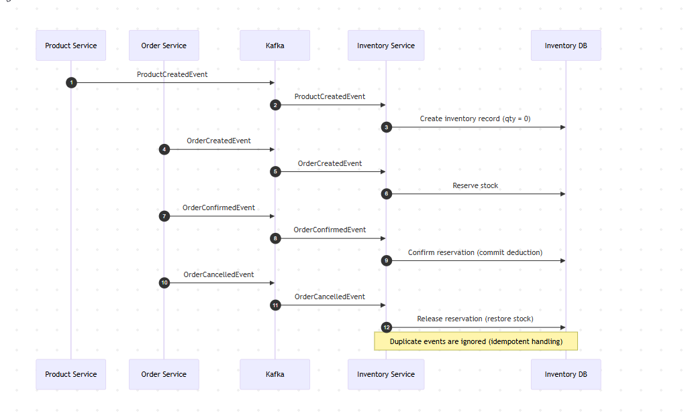

# Inventory Service

The Inventory Service manages product stock levels within the Product Orders Platform.
It tracks inventory quantities and reacts to order and payment events to maintain accurate stock availability.

It listens for order events via Kafka and updates inventory accordingly.

## Responsibilities

- Manage product stock levels
- Reserve inventory when orders are placed
- Restore inventory when orders expire or fail
- Publish inventory events to Kafka
- Maintain inventory records in MySQL

### Core Capabilities

- **Track stock per product**
    - Query available quantity for a product
    - Add new products to inventory (defaulting to 0 stock if not provided)
    - Update stock to a new absolute value

- **Reservation workflow for orders**
    - **Reserve**: temporarily hold stock for an order
    - **Confirm**: finalize reservations (commit them)
    - **Release**: cancel reservations and restore availability

## Architecture Role

The Inventory Service is the platform’s **stock authority** in an event-driven flow.

- **Consumes domain events** from other services (for example, product and order lifecycle events)
- **Maintains inventory consistency** by reserving, confirming, or releasing stock as orders progress
- **Publishes inventory outcomes** so downstream services can react without tight coupling
- **Enforces role-aware operations** for its APIs, where privileged inventory management actions are intended for
  `ADMIN`, while standard platform usage remains available to `USER`

## Tech Stack

| Technology      | Purpose               |
|-----------------|-----------------------|
| Java 17         | Runtime               |
| Spring Boot     | Application framework |
| Spring Data JPA | Database access       |
| Kafka           | Event messaging       |
| MySQL           | Inventory storage     |
| Flyway          | Database migrations   |
| Docker          | Containerization      |

## Environment Variables

An example list of environment variables is found in [`.env.example`](.env.example).

## Running the Service

Run the service using `docker-compose up --build` from [the root directory](../). To run this service in isolation, copy
the inventory service and mysql from the root [docker-compose](../docker-compose.yaml) file and run them separately. The
service will be available on port 8086.

## API Methods

Base path: `/api/inventory`

### 1) Get all products

- **Method:** `GET`
- **Path:** `/api/inventory/products`
- **Description:** Returns all inventory products with current available quantity.
- **Response:** `200 OK`

Example response:
[
{
"productId": "<product-uuid>",
"availableQuantity": 42
}
]

### 2) Get product by ID

- **Method:** `GET`
- **Path:** `/api/inventory/products/{productId}`
- **Description:** Returns inventory details for one product.
- **Path parameter:**
    - `productId` (UUID) — Product identifier
- **Response:** `200 OK`

Example response:
{
"productId": "<product-uuid>",
"availableQuantity": 42
}

### 3) Update product stock

- **Method:** `PATCH`
- **Path:** `/api/inventory/products/{productId}/stock`
- **Description:** Sets the absolute stock quantity for a product.
- **Path parameter:**
    - `productId` (UUID) — Product identifier
- **Request body:**
  {
  "newStock": 100
  }
- **Response:** `204 No Content`

## Database Schema

#### `product`

- `product_id` `binary(16)` — **PK**
- `available_quantity` `int(11)` — not null
- `version` `bigint(20)` — nullable (optimistic locking/versioning)

#### `inventory_reservation`

- `reservation_id` `binary(16)` — **PK**
- `order_id` `binary(16)` — not null
- `product_id` `binary(16)` — not null
- `quantity` `int(11)` — not null
- `reservation_status` `enum('CONFIRMED','RELEASED','RESERVED')` — not null
- `created_at` `datetime(6)` — not null
- `updated_at` `datetime(6)` — nullable
- Unique constraint: `uk_inventory_reservation_order_product (order_id, product_id)`

#### `processed_order_event`

- `id` `bigint(20)` — **PK**, auto increment
- `event_id` `binary(16)` — unique (`p_order_e_uk_event_id`)
- `processed_at` `datetime(6)` — not null

#### `processed_product_event`

- `id` `bigint(20)` — **PK**, auto increment
- `event_id` `binary(16)` — unique (`p_product_e_uk_event_id`)
- `processed_at` `datetime(6)` — not null

## Notes on security

Protected endpoints expect a JWT:

- `Authorization: Bearer <token>`

The JWT signature is verified using the Auth Service’s JWKS endpoint.